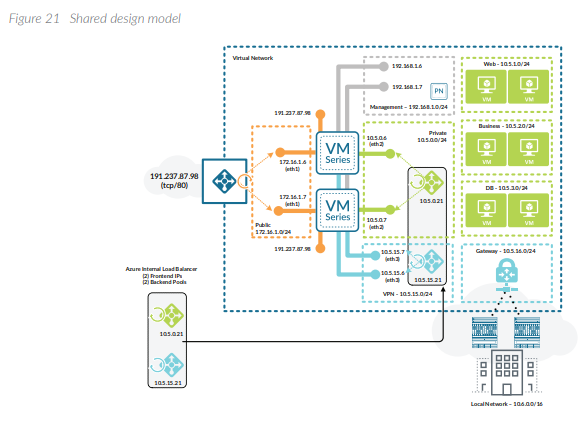

# Deploy a VM-Series firewall into an existing Azure Resource Group

[](https://portal.azure.com/#create/Microsoft.Template/uri/https%3A%2F%2Fraw.githubusercontent.com%2Fpaloaltonetworks%2Freferencearchitectures%2Fmaster%2FAzure-1FW-4-interfaces-existing-environment%2FAzureDeploy.json)

This template deploys a (4) interface Palo Alto Networks VM-Series firewall as shown below:

<p align="center">
  
</p>

Shared Design model

<p align="center">
  
</p>

This template was created to support the deployment of a 4 interface Palo Alto Networks firewall into an existing Microsoft Azure environment that has the following items already deployed:

                    - VNET (assumes "AzureRefArch-VNET" is already created with following subnets):
                      - Management (192.168.1.0/24)
                      - Public (172.16.1.0/24)
                      - Private (10.5.0.0/24)
                      - VPN (10.5.15.0/24)
                    - Resource Group (for the firewall) with the following resources:
                      - Availability Set for the firewall
                      - Storage Account for the firewall VHD
                      - Public IP address (Standard SKU) for the firewall management interface
                    
            
### FEATURES:
- The firewall deploys with (4) interfaces
  - (1) management interface 
  - (3) dataplane interfaces
  
- You may choose the version of software the firewall is running (7.1.1, 8.0.0, 8.1.0 or latest).
- You may choose the deployment SKU for the firewall: (byol, bundle1 or bundle2).
- Static IP address assignment is used for all the firewall interfaces.


The following Storage Account types are supported:

                    -Standard_LRS (used in deployment guide)
                    -Standard_GRS
                    -Standard_RAGRS
                    -Premium_LRS
                    
The following VMs are supported:

                    -Standard_D8s_v3 (my preferred)
                    -Standard_D3
                    -Standard_D4
                    -Standard_D3_v2 (used in deployment guide)
                    -Standard_D4_v2
                    -Standard_A4
                    -Standard_DS3_v2
                    -Standard_DS4_v2
        
NOTE: Make sure the VMs are supported in the specific Storage Account Type and Azure Region.

After deployment, this firewall can be integrated into Azure load balancer backend pools using the Azure Resource Manager Portal.

### PAN:

- https://aras-vmfw1.eastus.cloudapp.azure.com/ (refarchadmin)
- https://aras-vmfw2.eastus.cloudapp.azure.com/

### WEB:

aras-public-shared-web.eastus.cloudapp.azure.com

```
sudo apt update
sudo apt install apache2
sudo ufw allow 'Apache'
sudo ufw status
sudo systemctl status apache2
[Change Apache2 HTTP Default Port On Ubuntu 16.04 / 17.10 / 18.04](https://websiteforstudents.com/change-apache2-http-default-port-on-ubuntu-16-04-17-10-18-04/)
```

### TESTING 

- jumpserver: docker@R90HE73F:~$ ssh -i .ssh/id_rsa azureuser@x.x.x.x
- netadmin1a: ssh azureuser@10.5.2.4
- webserver1: ssh azureuser@10.5.0.4


##### OUTBOUND:

- ResourceGroupName="AzureRefArch"
- AdminPassword=''
- VnetName="AzureRefArch-VNET"
- SubnetName="Shared-Business"
- SshKey=''
```
az vm create \
    --resource-group $ResourceGroupName \
    --name $VmName \
    --image UbuntuLTS \
    --admin-username azureuser \
    --authentication-type password \
    --admin-password $AdminPassword \
    --size Standard_B1s \
    --use-unmanaged-disk \
    --storage-sku Standard_LRS \
    --public-ip-address "" \
    --vnet-name $VnetName --subnet $SubnetName

az vm open-port --port 22 --resource-group $ResourceGroupName --name $VmName

VmName="jumpserver"
SubnetName="Jump"

az network nic create \
    --resource-group $ResourceGroupName \
    --name jumpNicPrivate \
    --vnet-name $VnetName \
    --subnet $SubnetName \

az network nic create \
    --resource-group $ResourceGroupName \
    --name jumpNicPublic \
    --vnet-name $VnetName \
    --subnet $SubnetName \  

az vm create \
    --resource-group $ResourceGroupName \
    --name jumpserver \
    --size Standard_B1s \
    --image UbuntuLTS \
    --admin-username azureuser \
    --vnet $VnetName --subnet $SubnetName \
    --nics jumpNicPrivate, jumpNicPublic
    --public-ip-address-dns-name $VmName \
    --ssh-key-value $sSshKey
```

##### INBOUND: 

```
azureuser@webserver1:~$ sudo python3 -m http.server --bind 0.0.0.0 80
Serving HTTP on 0.0.0.0 port 80 (http://0.0.0.0:80/) ...
10.5.0.6 - - [26/Nov/2018 19:26:53] "GET / HTTP/1.1" 200 -
10.5.0.7 - - [26/Nov/2018 19:26:54] code 404, message File not found
```